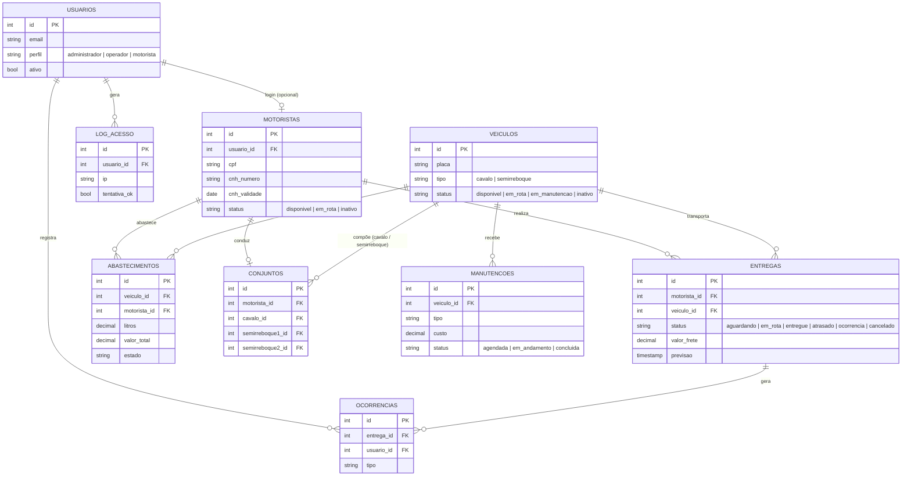

# LogTrack

Sistema de gestão operacional para transportadoras de pequeno e médio porte: entregas, motoristas, veículos, manutenções, abastecimento, ocorrências e faturamento centralizados em um único lugar, com controle de acesso por perfil.

> Projeto acadêmico desenvolvido a partir de uma necessidade real de uma transportadora, hoje em uso operacional.

## O problema

Transportadoras pequenas costumam controlar entregas, motoristas e veículos por planilhas soltas, papel e WhatsApp. Sem um sistema central, informação se perde, prazos escapam do controle e decisões são tomadas sem dados confiáveis.

## Funcionalidades

- **Entregas** — acompanhamento por status (aguardando, em rota, entregue, atrasado, ocorrência, cancelado), com filtros e resumo por indicador.
- **Motoristas** — cadastro com validação de CPF/CNH, alerta automático de CNH prestes a vencer, login opcional.
- **Veículos e Conjuntos** — frota por tipo (cavalo-mecânico, semirreboque), montagem de conjuntos vinculados a um motorista.
- **Manutenções** — histórico por veículo com custo, quilometragem e exportação de relatório em PDF.
- **Abastecimento** — registro de abastecimentos com preço do diesel por estado.
- **Ocorrências** — registro de atrasos, acidentes e problemas vinculados à entrega e ao veículo.
- **Relatórios e Dashboard** — indicadores de desempenho por período, faturamento do mês, ranking de motoristas, exportação em PDF.
- **Usuários e Perfis** — administrador, operador e motorista, cada um com acesso restrito ao que precisa (ex.: motorista só vê Dashboard e as próprias entregas).

## Arquitetura

```
frontend/   HTML/CSS/JS puro (sem build tool), consumindo a API via fetch
app/
  routers/     endpoints FastAPI (um arquivo por domínio)
  models/      modelos SQLAlchemy
  schemas/     schemas Pydantic (validação de entrada/saída)
  repositories/ acesso a dados
  services/    regras de negócio
  auth.py      autenticação JWT + bcrypt
```

**Stack:** FastAPI · SQLAlchemy · PostgreSQL · JWT + bcrypt · Docker

O controle de acesso por perfil é reforçado tanto no frontend (itens de menu escondidos por perfil) quanto na API (cada endpoint sensível valida o perfil do usuário autenticado antes de responder).

## Modelo de dados



Schema completo em [logtrack_banco.sql](logtrack_banco.sql).

## Como rodar

### Opção 1 — Docker

```bash
cp .env.example .env
# edite o .env: defina POSTGRES_PASSWORD, DOCKER_DATABASE_URL e SECRET_KEY
docker-compose up --build
```

A API sobe em `http://localhost:8000`.

### Opção 2 — Local (venv + Postgres nativo)

```bash
python -m venv venv
venv\Scripts\activate          # Windows
pip install -r requirements.txt

cp .env.example .env
# edite o .env: defina DATABASE_URL e SECRET_KEY

# crie o banco "logtrack" no Postgres e rode o schema:
psql -U postgres -d logtrack -f logtrack_banco.sql

uvicorn app.main:app --reload
```

### Frontend

O frontend é HTML/CSS/JS estático (sem build). Basta abrir `frontend/index.html` no navegador, ou servir a pasta com qualquer servidor estático — ele consome a API em `http://127.0.0.1:8000` (configurado em [frontend/js/api.js](frontend/js/api.js)).

## Documentação da API

Com o backend rodando, a documentação interativa (Swagger) fica disponível em `http://localhost:8000/docs`.

## Testes

```bash
pip install -r requirements-dev.txt
pytest tests/ -v
```

A suite cobre:
- **Autenticação** — login válido/inválido, usuário inativo, token expirado/ausente.
- **Acesso por perfil** — motorista só enxerga Dashboard e as próprias entregas; todo outro endpoint retorna 403.
- **Motoristas** — validação de CPF (dígito verificador) e CNH, CPF/e-mail duplicado, permissões de criação/edição/exclusão por perfil.
- **Veículos** — placa duplicada, criação restrita a administrador.
- **Entregas** — bloqueio de motorista/veículo já em rota ou em manutenção ao criar uma nova entrega.

Os testes rodam contra um SQLite isolado em memória via override de `get_db`; nunca tocam no Postgres real.

## Deploy

O frontend é servido pelo próprio FastAPI (`StaticFiles` montado em `/` em [app/main.py](app/main.py), depois de todas as rotas da API) — um único serviço, uma única URL, sem CORS entre origens pra configurar. Em produção, [frontend/js/api.js](frontend/js/api.js) detecta isso automaticamente (`location.origin`); rodando localmente como arquivo (`file://`), continua caindo em `http://127.0.0.1:8000` como antes.

Hospedagem recomendada: [Render](https://render.com), com o Blueprint em [render.yaml](render.yaml) (web service a partir do `Dockerfile` + Postgres gerenciado). Passo a passo:

1. Criar conta no Render e conectar a conta do GitHub com acesso a este repositório.
2. **New → Blueprint**, apontar para o repo — o Render lê o `render.yaml` e propõe o web service + o banco Postgres juntos.
3. Confirmar o deploy. `SECRET_KEY` é gerado automaticamente; `DATABASE_URL` é preenchido a partir do banco criado junto.
4. Levar os dados que já existem no banco local pro banco novo do Render (schema + tudo que já foi cadastrado — motoristas, veículos, entregas, conjuntos, seu próprio login):
   ```bash
   # 1) dump do banco local (usa o DATABASE_URL do seu .env)
   pg_dump "$DATABASE_URL" --no-owner --no-privileges -F c -f logtrack_backup.dump

   # 2) restore no banco do Render (pegue a "External Database URL" no painel do banco)
   pg_restore --no-owner --no-privileges -d "<connection string externa do Render>" logtrack_backup.dump
   ```
   O arquivo `logtrack_backup.dump` contém dados reais (CPF, CNH, etc.) — nunca commitar, apagar depois de usar.

`scripts/seed_demo.py` fica disponível como alternativa, caso um dia você queira um ambiente separado só pra demonstração/testes, sem usar os dados reais.

Confira os limites atuais do plano gratuito ao criar a conta (mudam com frequência) — para uso real e contínuo pela transportadora, o caminho natural é o plano pago tanto do web service quanto do banco.

**Limitação conhecida:** a pasta `uploads/` (fotos de veículos, conjuntos e ocorrências) é gravada no disco do container, que é efêmero em hospedagem sem disco persistente — os arquivos somem a cada redeploy. Resolver isso (disco persistente pago, ou storage externo tipo S3) fica como próximo passo, fora do escopo deste deploy inicial.
